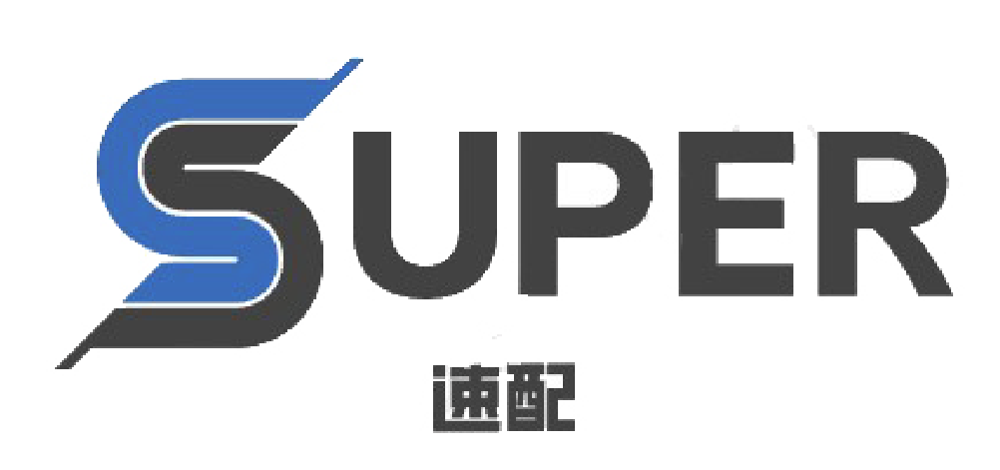
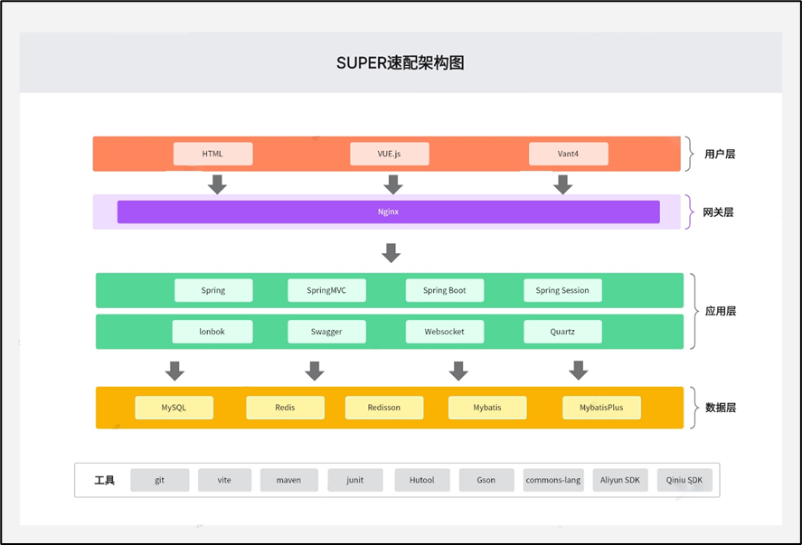
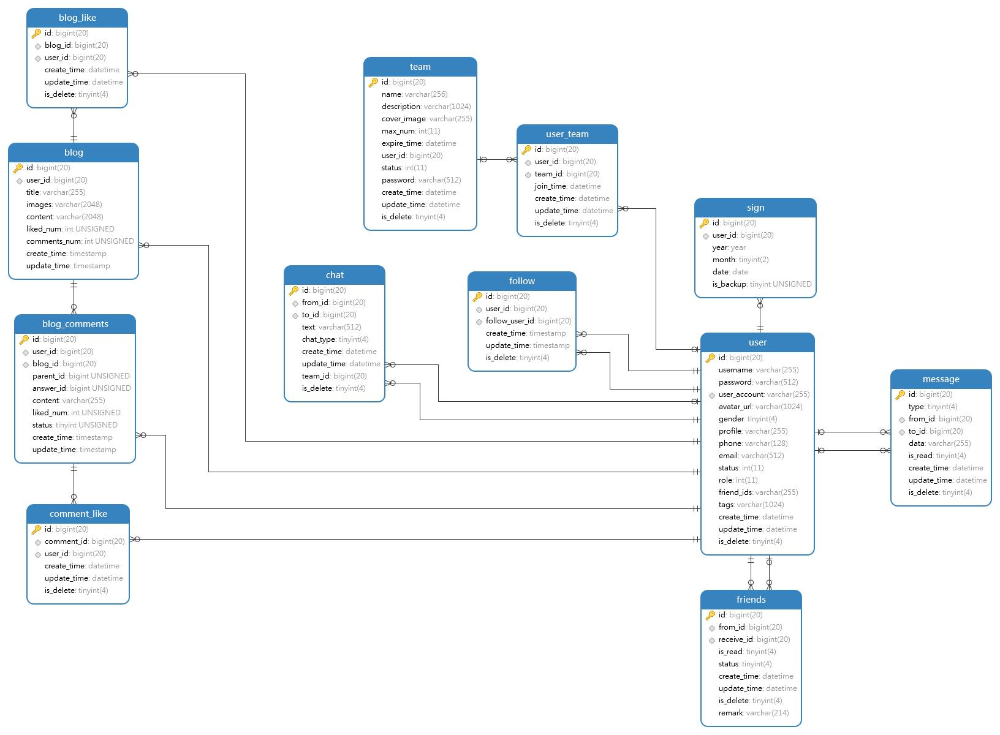

<p align="center">

</p>
<p align=center>
   SUPER速配-伙伴匹配系统
</p>
<p align="center">
<a target="_blank" href="https://gitee.com/ochiamaluo/super-backend">
    	</img>
		</img>
        </img>
        </img>
        </img>
		</img>
        </img>
        </img>
		</img>
		</img>
		</img>
</a></p>


## 项目介绍

​		速配(SUPER)，一个前后端分离的用户匹配系统，前端使用**Vite + Vue3 + Vant4**，后端使用**SpringBoot** + **Mybatis-plus**，使用**WebSocket**实现实时通信，并结合**阿里云SDK + 七牛云SDK**完成短信发送和图片上传。本项目使用Apache License Version 2.0开源协议。
#### 前端地址:

https://gitee.com/ochiamaluo/super-frontend

#### 后端地址:

https://gitee.com/ochiamaluo/super-backend

## 在线体验

演示地址: http://ochiamalu.xyz

账号可以自行注册，一切聊天、评论需遵守中华人民共和国有关法律规定。

仅支持中国大陆手机号，若没有符合要求的手机号或本网站短信功能无法使用，请使用以下账号直接登录：

账号：admin

密码：12345678

## 项目背景

​      许多热爱编程比赛的用户在参加比赛时常常面临没有队友的问题，这使得他们很难发挥自己的实力，也很难取得好成绩。同时，许多用户在寻找队友时也面临一些困难，比如无法找到合适的人选，或者无法与潜在的队友进行充分的交流和沟通。因此，我们希望通过该网站，为这些用户提供一个交流平台，帮助他们找到理想的队友，组建强大的编程团队，参加各种编程比赛，并最终实现自己的编程梦想。

## 核心功能

1. 用户注册和登录：用户可以通过注册账号并登录使用该网站。
2. 标签匹配：用户可以选择自己的技能和需求标签，系统会根据标签匹配合适的队友。
3. 组队功能：用户可以与其他用户组建队伍，一起参加编程比赛。
4. 帖文发布、点赞和关注：用户可以发布自己的帖文，其他用户可以对其进行点赞和关注，以便更好地了解和交流。
5. 实时聊天：队伍中的用户可以进行实时聊天，方便沟通和协作。
6. 用户管理：管理员可以对用户进行管理，包括审核用户信息和处理用户投诉等。

## 项目亮点

1. 用户登录：使用 Redis 实现分布式 Session，解决集群间登录态同步问题；使用token储存用户信息并实现续签和超时自动退出。

2. 对于项目中复杂的集合处理（比如为队伍列表关联已加入队伍的用户），使用 Java 8 Stream API 和 Lambda 表达式来简化编码。

3. 使用 Redis 缓存首页高频访问的用户信息列表，将接口响应时长从 12520ms缩短至400ms。且通过自定义 Redis 序列化器来解决数据乱码、空间浪费的问题。

4. 为解决首次访问系统的用户主页加载过慢的问题，使用 quartz 定时任务来实现缓存预热，并通过分布式锁保证多机部署时定时任务不会重复执行。

5. 为解决同一用户重复加入队伍、入队人数超限的问题，使用 Redisson 分布式锁来实现操作互斥，保证了接口幂等性。

6. 使用编辑距离算法实现了根据标签匹配最相似用户的功能，并通过优先队列来减少 TOP N 运算过程中的内存占用。

7. 自主编写 Dockerfile，并通过第三方容器托管平台实现自动化镜像构建及容器部署，提高部署上线效率。

8. 使用 Knife4j + Swagger 自动生成后端接口文档，并通过编写 ApiOperation 等注解补充接口注释，避免了人工编写维护文档的麻烦。

9. 使用本地+云服务储存用户头像，并自定义cdn加速域名指向项目专用储存空间。

10. 使用WebSocket在单个TCP连接上进行全双工通信，创建持久性的连接，实现队伍聊天室中的实时聊天。

11. 前端使用 Vant UI 组件库，并封装了全局通用的 Layout 组件，使主页、搜索页、组队页布局一致、并减少重复代码。

12. 基于 Vue Router 全局路由守卫实现了根据不同页面来动态切换导航栏标题， 并通过在全局路由配置文件扩展 title 字段来减少无意义的 if else 代码。

13. 使用component is标签自定义少数页面的基本布局，优化用户体验。

14. 封装前端卡片组件，对数据做统一处理，减少重复代码。

15. 使用defineEmits为子组件绑定事件，并使用emits将事件发送给父组件，优化用户在操作后的体验。

## 项目文档

文档地址： http://doc.ochiamalu.xyz/

## 项目地址

目前项目托管在 **Gitee** 和 **Github** 平台上中，欢迎大家 **Star** 和 **Fork** 支持~

- Gitee 地址： https://gitee.com/ochiamaluo/super-backend
- Github地址： https://github.com/OchiaMalu/super-backend

## 技术选型

**前端**

\- Vue 3

\- Vite 脚手架

\- Vant UI 移动端组件库

\- Axios 请求库


**后端**

\- JAVA SpringBoot 框架

\- MySQL 数据库

\- Mybatis-Plus

\- Mybatis X

\- Redis缓存

\- Redisson 分布式锁

\- Quartz定时任务

\- Swagger + Knife4j 接口文档

\- Gson JSON序列化库

\- 最短编辑距离算法

\- WebSocket

### 软件架构



### 数据库架构



## 后端部署

1. 执行安装后端所需依赖

   ```bash
   maven install
   ```

2. 修改application.xml，其中spring.mail为非必填项，不填写则无法发送邮件
3. 修改SMSUtils配置，若不修改则无法发送验证码短信，可通过控制台输出的方式获取生成的验证码。

4. 新建super数据库，并执行super.sql
5. 运行SuperApplication

## 贡献代码

开源项目离不开大家的支持，如果您有好的想法，遇到一些 **BUG** 并修复了，欢迎小伙伴们提交 **Pull Request** 参与开源贡献！

1. **fork** 本项目到自己的 **repo**
2. 把 **fork** 过去的项目也就是你仓库中的项目 **clone** 到你的本地
3. 修改代码
4. **commit** 后 **push** 到自己的库
5. 发起**PR**（ **pull request**） 请求，提交到 **dev** 分支
6. 等待作者合并
